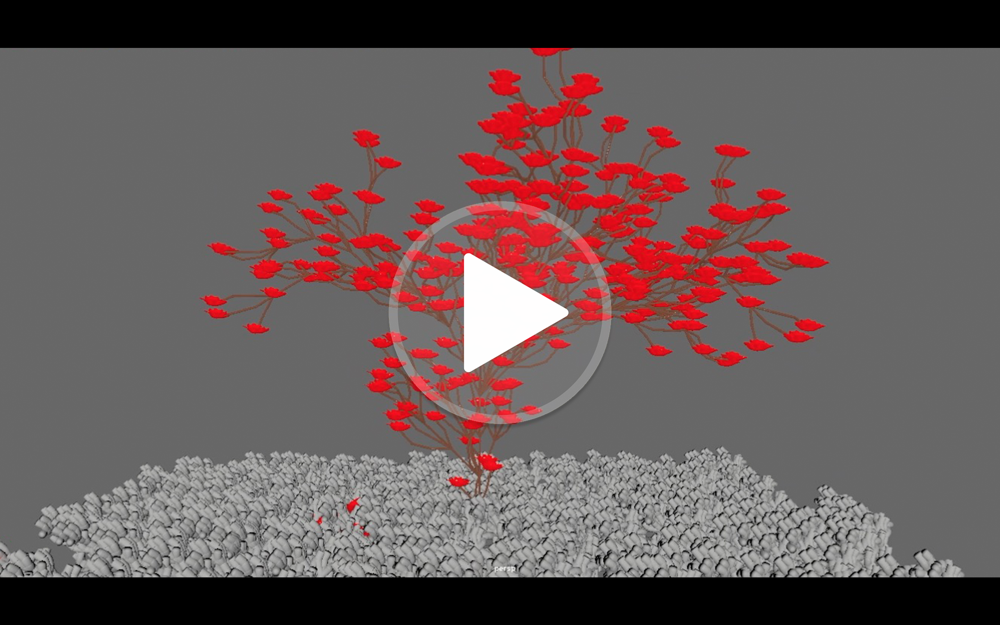
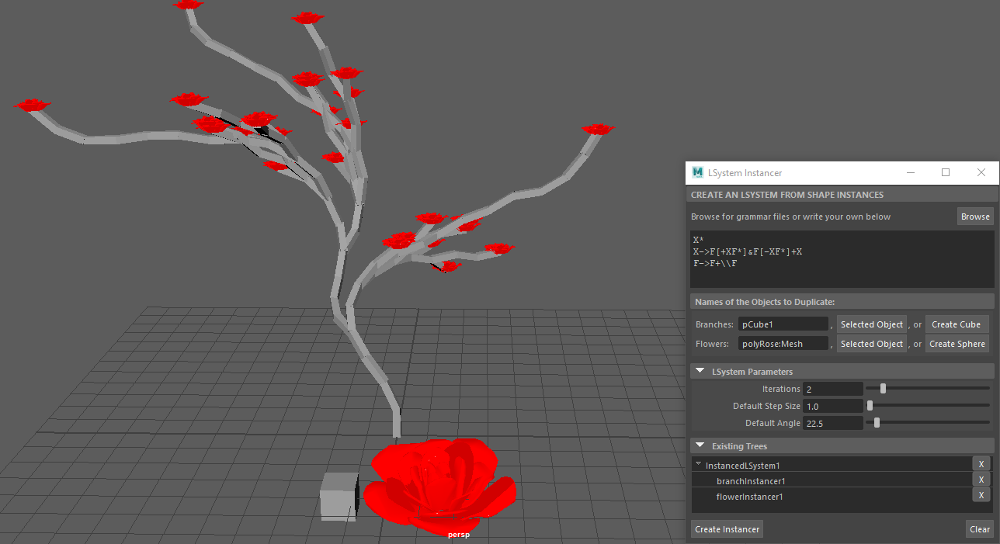

# Plug-ins with Python & SWIG and the Maya Dependency Graph

#### *Alexis Ward*

Built in **Microsoft Visual Studio 2015** for **Maya 2019** using **Python 2.7.17** and **SWIG 4.0.1** on Windows 10 20H2

## Demo Video

## RandomNode Network 

A .py plug-in which allows the user to call a MEL script that connect some shape and a "randomNode" to an instancer for random object placement. The default option is to use a polygon sphere, but it can work with any pre-selected geometry.

<table>
  <tr>
    <td></td>
    <td></td>
    <td></td>
  </tr>
  <tr>
    <td>randomNode Attributes</td>
    <td>Random Spheres</td>
    <td>Maya Hypergraph</td>
  </tr>
 </table>

## LSystemInstanceNode Network

A .py plug-in which allows the user to call a MEL script that generates a LSystem and constructs each of its branches and flowers using two separate instancers. The default option is to use a cube for the branches and a sphere for the flowers, but it can work with any pre-selected shapes.

<table>
  <tr>
    <td></td>
    <td></td>
    <td></td>
  </tr>
  <tr>
    <td>LSystemInstanceNode Attributes</td>
    <td>Maya Hypergraph Hierarchy</td>
    <td>Maya Hypergraph Connections</td>
  </tr>
 </table>

## The Assignment

I've completed all questions/parts of the assignment, and some optional or bonus features:

**Shape Selection:** Added menu options (under *Create*) to reopen the popups as needed, and I used the ScrollField widget from HW2 to load grammar data. For both *randomNode* and *LSystemInstanceNode*, I have three options for how you can get geometry as an input to your instancer, all in one section. The first is the option to type in the desired object's name, the second is a button that will use the (singular) object that you have selected, and the third is a button that creates a *polyCube* or *polySphere*. The *LSystemInstanceNode* dialog has two of these sections; one for branches and one for flowers. I was going to add an option to fill both shape inputs at once if you have two objects selected, but I liked this structure instead.

**Hierarchy Preview:** For each LSystem Instance's instancer pair, I created a parent transform node. I added a treeView in *LSystemInstanceNode*'s dialog that makes each node easy to select, so that you can move both the branches and the flowers at the same time (or inspect them independently). This also provides an option to delete these nodes.

**Grammar:** Like with HW2, the *Grammar* attribute for *LSystemInstanceNode* shows the actual grammar text by default, but you can load via filename by clicking the *From File* checkbox and then typing the name of any text file located in the "plants" folder. I added a few *flowers* files to refer to.

## Visual Studio Project Properties

Make sure the solution platform is set to x64. Adjust to whichever Maya version you desire.

For example, this was built with *[MayaInstallDir Path] = C:\Program Files\Autodesk\Maya2019* and *[PythonPath] = C:\Python27*

#### LSystem

**Configuration:** All Configurations

**General &rarr; *Output Directory:*** $(ProjectDir)\bin\ or $(ProjectDir)bin\

**General &rarr; *Target Name:*** _$(ProjectName)

**General &rarr; *Target Extension:*** .pyd

**C/C++ &rarr; *General &rarr; Additional Include Directories:*** [PythonPath]\include;%(AdditionalIncludeDirectories)

**Linker &rarr; *General &rarr; Additional Library Directories:*** [PythonPath]\libs;%(AdditionalLibraryDirectories)

##### LSystem.i Properties:

**General &rarr; *Item Type:*** Custom Build Tool

**Custom Build Tool &rarr; *General &rarr; Command Line:*** swigwin-4.0.1\swig.exe -c++ -python -outdir $(Outdir) %(Identity)

**Custom Build Tool &rarr; *General &rarr; Outputs:*** %(Filename)_wrap.cpp;$(Outdir)%(Filename).py